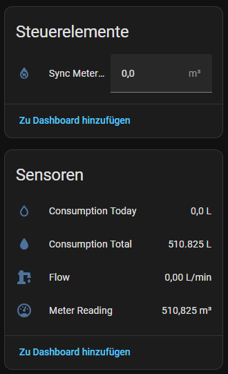
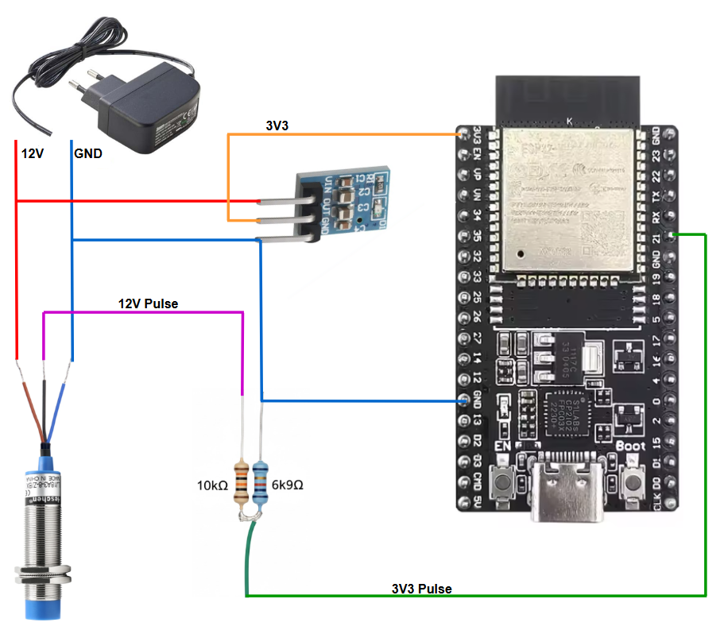

# Water Meter

An ESP32 and a proximity sensor are used to evaluate the water reading value.

The easiest way is to import the content of the YAML script in [ESPHome Builder](https://esphome.io/guides/getting_started_hassio/).
And add all required **SECRET** values to the `secrets.yaml`.

Finally, you can add a device to the ESPHome integration that provides the following possibilities:


Thanks to [Home Assitant Comunity](https://community.home-assistant.io/t/build-a-water-meter-with-esphome-and-proximity-sensor-no-soldering-required/387686)
and [Pieter Brinkman](https://www.pieterbrinkman.com/2022/02/02/build-a-cheap-water-usage-sensor-using-esphome-home-assistant-and-a-proximity-sensor/)

## Prerequisites

### Hardware

For this project I used the following hardware:

- [ESP32 Development Board 32D Type-C KIT](https://de.aliexpress.com/item/1005007820190456.html?spm=a2g0o.order_list.order_list_main.92.69515c5fBpw7nB&gatewayAdapt=glo2deu)
- 12 V power adapter [SYS1421-0612-W2E](https://asset.conrad.com/media10/add/160267/c1/-/gl/000510818ML03/bruksanvisning-510818-dehner-elektronik-sys-1421-0605-w2e-euro-naetadapter-fast-5-vdc-1200-ma-6-w.pdf)
- 3.3 V voltage regulator [RUNCCI-YUN 1117-3.3](https://www.amazon.de/dp/B0F59YRQPL?ref=ppx_yo2ov_dt_b_fed_asin_title)
- Inductive proximity sensor [LJ18A3-8-Z/BX](https://www.amazon.de/dp/B071FTP2ZP?ref=ppx_yo2ov_dt_b_fed_asin_title&th=1)
- Voltage divider for the 12 V pulse signal to 3.3 V consisting of 10 kΩ and 6.9 kΩ resistors. This scales the proximity sensor signal down to a level suitable for the ESP32 GPIO.

For the mount I used the 3D-printed model [LJ18A3-8Z/BX proximity sensor holder for Sensus 620 volumetric water meter](https://www.thingiverse.com/thing:6408085) that was modified a little bit.
The modification consists of adding additional tabs to securely attach the holder to the water meter.

## Wiring diagram

Wiring was done according to the following plan:


## Build target firmware on a Host

Python with `esphome` installed globally:

```shell
pip install esphome
```

## Check configuration and run build

```shell
esphome config ./water-meter.yaml
```

```shell
esphome run ./water-meter.yaml
```
